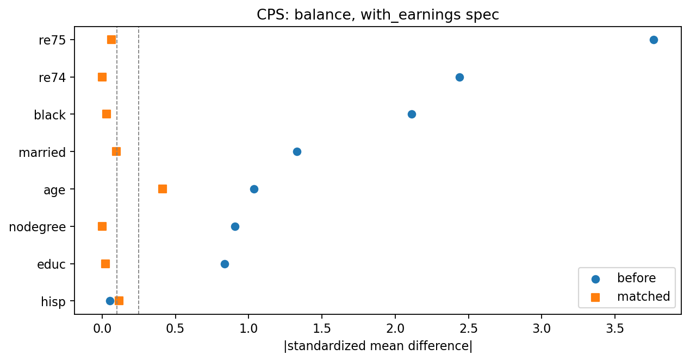

# Does propensity score matching actually recover the truth?

A propensity-score pipeline involves roughly eight design decisions: which covariates to include, which model to fit, which caliper to use, whether to match with replacement, what to trim, which estimand to target, which estimator to trust, and how to compute uncertainty.

On real business data, **none of these decisions can be validated**, because there is no right answer to check against.

This repository runs the same pipeline on a dataset where the right answer *is* known, and scores every decision against it.

---

## The benchmark

The National Supported Work (NSW) Demonstration was a real randomized experiment run from 1975 to 1979. Disadvantaged workers who applied to a subsidized job-training program were assigned by lottery, so comparing the two randomized arms gives an unbiased estimate of the program's effect on 1978 earnings.

Participants were people facing severe barriers to employment: long-term welfare recipients, ex-offenders, recovering addicts, and school dropouts. The program gave them 9 to 18 months of supervised paid work across ten cities. Applicants outnumbered places, so admission was decided by lottery — which is the only reason a ground truth exists here at all. [Fuller background](docs/background.md).

| | Estimate | 95% CI |
|---|---|---|
| **Experimental benchmark (ATT)** | **+$1,794** | [474, 3,115] |

Following LaLonde (1986) and Dehejia & Wahba (1999), the randomized control group is then **discarded** and replaced with survey respondents from the Current Population Survey (CPS) or the Panel Study of Income Dynamics (PSID). This creates an observational study with genuine confounding: survey respondents really are older, better educated, and far higher earning than NSW participants.

The question becomes: can the pipeline recover $1,794 from the observational data alone?

## Headline results

Covariates are the eight selected by the DAG in [notebook 02](notebooks/02_propensity_model.ipynb): age, education, race, marital status, degree, and 1974 and 1975 earnings. Every one is a column the source files provide — nothing is constructed. The propensity model is an unpenalized logistic regression. Outcome is 1978 earnings in dollars.

| Method | CPS controls | PSID controls ⚠ |
|---|---|---|
| Naive difference | -8,498 | -15,205 |
| Matching, 0.2 logit-SD caliper, no replacement | **1,530** [161, 2,900] | 214 [-1,792, 2,220] |
| Matching, with replacement | 1,654 [276, 3,031] | 2,169 [860, 3,479] |
| IPW (ATT weights) | 1,091 [-207, 2,389] | 1,610 [-171, 3,392] |
| AIPW (doubly robust) | 1,342 [164, 2,627] | 2,282 [321, 4,028] |

The naive comparison is not merely biased, it has the **wrong sign** and is off by more than $10,000. Every CPS estimate covers the experimental benchmark. The matching estimates also exclude zero; the IPW intervals do not, so on those the program's effect is not distinguishable from nothing.

**⚠ The PSID column is reported but disqualified**, and the reason has nothing to do with its numbers. Caliper matching finds no acceptable partner for **91 of the 185 participants** — and the ones it drops are the youngest, poorest, least likely to be married, with essentially no prior earnings. That is the most disadvantaged half of the program, which is the population the program was built for. Whatever comes out is no longer the ATT; it is the effect on the 94 participants who happened to have counterparts. Nothing in a standard matching output reveals this: you would see 94 pairs, an acceptable balance table, and a confidence interval.

**Balance is not achieved on CPS either.** Matching brings the worst covariate from |SMD| 3.76 down to **0.307** — a large improvement, and still past the conventional 0.25 threshold, with `age` the offender:



## What breaks it

The interesting findings are not that the method works. They are the conditions under which it fails.

- **Omitting pre-treatment outcomes flips the sign, and the diagnostics do not warn you.** Drop the 1974 and 1975 earnings variables and the CPS estimate moves from **+1,530 to -3,414**. Meanwhile every covariate still in the model balances to |SMD| ≤ **0.055**, far inside the conventional 0.1 threshold — textbook-clean balance on a badly wrong answer. The omitted earnings variables sit at |SMD| 2.12, but you would only know to look at them if you already suspected they mattered.
- **A control pool can silently change the estimand.** PSID matching drops 91 of 185 participants, and drops them non-randomly: the youngest and poorest. The output still reports pairs, balance and an interval. The estimand changed and the diagnostics stayed green.
- **Matching with replacement trades the estimand back for balance.** On PSID it keeps all 185 treated units but max |SMD| rises to **0.33**; on CPS it rises to 0.41. The two failure modes are not independent — you are choosing which one to accept.
- **A fixed caliper on the raw probability scale is fragile.** A 0.01 caliper leaves 8 of 185 CPS participants unmatched and 105 of 185 in PSID, where 0.2 logit-SD leaves 0 and 91. A fixed probability width means something different wherever the scores pile up, and here they pile up against zero. Calipers in standard deviations of the logit are more portable.
- **Good balance is necessary, not sufficient.** PSID's matched sample is the *better balanced* of the two pools (0.14 against CPS's 0.31) and is the one that has to be thrown out. A balance table cannot tell you who is missing from it.
- **Confidence intervals are wide, and that is the data's fault.** The randomized benchmark itself has a CI spanning $2,641. With 185 treated units, no estimator can be more precise than that. Point estimates matching to the dollar are luck, not evidence.

## What the benchmark is allowed to be used for

This repository holds the answer. That creates a temptation worth naming, because giving in to it would invalidate everything here and **nothing in the output would look wrong**: try covariate sets, calipers and model settings, keep whichever lands nearest $1,794, and present the result as a validation of the method.

So the rule this project runs under:

> **Design decisions use only diagnostics a real study could compute** — covariate balance, common support, how many units survive matching. **The benchmark scores the finished pipeline. It never selects any part of it.**

Two consequences visible above. The propensity model is unpenalized because that is the specification with no tuning constant to choose, not because it landed closest — on this covariate set balance does not favour it consistently. And PSID is disqualified on its 49% match rate, a number any real study could compute, rather than on its distance from the benchmark.

This is what makes the exercise a test rather than a demonstration. A pipeline tuned against the answer would score well here and transfer nowhere.

## Repository layout

```
src/psm.py          estimation toolkit, dataset agnostic
  fit_propensity      logistic or gradient boosting, optional cross-fitting
  nn_match            greedy 1:1 NN, caliper on logit or raw scale, explicit pair_id
  smd / balance_table standardized differences against a fixed reference SD
  att_matched         paired t-test plus pair-level bootstrap
  ipw_weights / ipw_estimate   explicit ATT vs ATE weights, HC1 robust SE
  aipw_att            doubly robust estimator with bootstrap CI
src/figures.py      every plot in the project, saved through one convention
src/data.py         loading and covariate specifications

notebooks/          the analysis, one notebook per pipeline stage
  01_data_prep         raw files to analysis sample
  02_propensity_model  the DAG, the covariate choice, and the scores
  03_matching_balance  matching and balance diagnostics
  04_effects_att       ATT, IPW, doubly robust, against the benchmark

scripts/run_all.py  reproduces every number: 2 pools x 2 specs x 6 estimators
outputs/            generated artifacts: data/ between stages, figures/, tables/
data/raw/lalonde/   the four source files, with provenance
```

Notebooks hand data to each other through files in `outputs/data/` rather than
through memory, so each stage can be re-run on its own and a reader can inspect
any intermediate product without executing anything.

## Reproduce

```bash
pip install -r requirements.txt
python scripts/run_all.py
```

Results are written to `outputs/tables/results.csv`, where every row carries a `covers_truth` flag and the number of matched pairs retained, so each claim above can be audited.

## Data

All four files come from [Rajeev Dehejia's data page](https://users.nber.org/~rdehejia/data/), the standard Dehejia-Wahba subsample. Columns are `treat age educ black hisp married nodegree re74 re75 re78`.

| File | Rows | Source |
|---|---|---|
| `nswre74_treated.txt` | 185 | NSW participants |
| `nswre74_control.txt` | 260 | NSW randomized controls |
| `cps_controls.txt` | 15,992 | Current Population Survey respondents |
| `psid_controls.txt` | 2,490 | Panel Study of Income Dynamics respondents |

## References

- LaLonde, R. (1986). Evaluating the econometric evaluations of training programs with experimental data. *American Economic Review*.
- Dehejia, R. and Wahba, S. (1999). Causal effects in nonexperimental studies: reevaluating the evaluation of training programs. *JASA*.
- Smith, J. and Todd, P. (2005). Does matching overcome LaLonde's critique of nonexperimental estimators? *Journal of Econometrics*.

## Note

This is an independent project built entirely on public data, inspired by a causal inference question I encountered professionally. It contains no proprietary data, code, or results.
