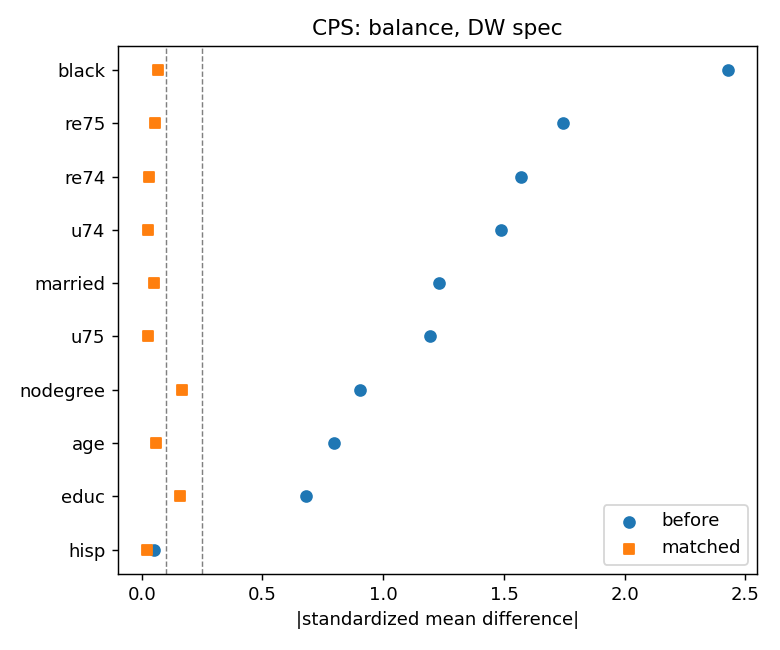

# Does propensity score matching actually recover the truth?

A propensity-score pipeline involves roughly eight design decisions: which covariates to include, which model to fit, which caliper to use, whether to match with replacement, what to trim, which estimand to target, which estimator to trust, and how to compute uncertainty.

On real business data, **none of these decisions can be validated**, because there is no right answer to check against.

This repository runs the same pipeline on a dataset where the right answer *is* known, and scores every decision against it.

---

## The benchmark

The National Supported Work (NSW) Demonstration was a real randomized experiment run from 1975 to 1979. Disadvantaged workers who applied to a subsidized job-training program were assigned by lottery, so comparing the two randomized arms gives an unbiased estimate of the program's effect on 1978 earnings.

| | Estimate | 95% CI |
|---|---|---|
| **Experimental benchmark (ATT)** | **+$1,794** | [474, 3,115] |

Following LaLonde (1986) and Dehejia & Wahba (1999), the randomized control group is then **discarded** and replaced with survey respondents from the Current Population Survey (CPS) or the Panel Study of Income Dynamics (PSID). This creates an observational study with genuine confounding: survey respondents really are older, better educated, and far higher earning than NSW participants.

The question becomes: can the pipeline recover $1,794 from the observational data alone?

## Headline results

Covariates include pre-treatment earnings plus the Dehejia-Wahba nonlinear terms. Outcome is 1978 earnings in dollars.

| Method | CPS controls | PSID controls |
|---|---|---|
| Naive difference | -8,498 | -15,205 |
| Matching, 0.2 logit-SD caliper, no replacement | **1,752** [92, 3,413] | -396 [-2,393, 1,602] |
| Matching, with replacement | 2,104 [678, 3,531] | 2,384 [1,087, 3,682] |
| IPW (ATT weights) | 1,630 [227, 3,034] | 2,764 [1,082, 4,446] |
| AIPW (doubly robust) | 1,788 [283, 3,254] | 2,899 [831, 4,987] |

The naive comparison is not merely biased, it has the **wrong sign** and is off by more than $10,000. After matching, every ATT estimator on the CPS pool produces a confidence interval covering the experimental benchmark.

Covariate balance improves from |SMD| up to 2.4 before matching to below 0.2 after:



## What breaks it

The interesting findings are not that the method works. They are the conditions under which it fails.

- **Omitting pre-treatment outcomes flips the sign.** Drop the 1974 and 1975 earnings variables and the estimate moves from +1,752 to roughly -3,000, while balance diagnostics on the remaining covariates still look acceptable. The confounder you did not measure is the one that matters.
- **Matching without replacement can silently change the estimand.** On the PSID pool, no-replacement matching retains only 79 of 185 treated units. The result is no longer the ATT for the treated population, and nothing in the standard output tells you.
- **A fixed caliper on the raw probability scale is fragile.** A caliper of 0.01 behaves very differently depending on how propensity scores are distributed. Calipers expressed in standard deviations of the logit are more portable.
- **ATT and ATE are different questions.** On PSID they differ by about $3,300, and the ATE has confidence intervals spanning zero because it requires extrapolating to a population containing no comparable treated units.
- **Confidence intervals are wide, and that is the data's fault.** The randomized benchmark itself has a CI spanning $2,641. With 185 treated units, no estimator can be more precise than that. Point estimates matching to the dollar are luck, not evidence.

## Repository layout

```
src/psm.py                        reusable toolkit, dataset agnostic
  fit_propensity                  logistic or gradient boosting, optional cross-fitting
  nn_match                        greedy 1:1 NN, caliper on logit or raw scale, explicit pair_id
  smd / balance_table / love_plot balance diagnostics with fixed reference SD
  att_matched                     paired t-test plus pair-level bootstrap
  ipw_weights / ipw_estimate      explicit ATT vs ATE weights, HC1 robust SE
  aipw_att                        doubly robust estimator with bootstrap CI

validation/lalonde/run_lalonde.py  2 control pools x 3 covariate specs x 6 estimators
validation/lalonde/results/        results.csv, love plots, overlap plots
data/raw/lalonde/                  the four source files, with provenance
```

## Reproduce

```bash
pip install -r requirements.txt
python validation/lalonde/run_lalonde.py
```

Results are written to `validation/lalonde/results/results.csv`, where every row carries a `covers_truth` flag and the number of matched pairs retained, so each claim above can be audited.

## Data

All four files come from [Rajeev Dehejia's data page](https://users.nber.org/~rdehejia/data/), the standard Dehejia-Wahba subsample. Columns are `treat age educ black hisp married nodegree re74 re75 re78`.

| File | Rows | Source |
|---|---|---|
| `nswre74_treated.txt` | 185 | NSW participants |
| `nswre74_control.txt` | 260 | NSW randomized controls |
| `cps_controls.txt` | 15,992 | Current Population Survey respondents |
| `psid_controls.txt` | 2,490 | Panel Study of Income Dynamics respondents |

## References

- LaLonde, R. (1986). Evaluating the econometric evaluations of training programs with experimental data. *American Economic Review*.
- Dehejia, R. and Wahba, S. (1999). Causal effects in nonexperimental studies: reevaluating the evaluation of training programs. *JASA*.
- Smith, J. and Todd, P. (2005). Does matching overcome LaLonde's critique of nonexperimental estimators? *Journal of Econometrics*.

## Note

This is an independent project built entirely on public data, inspired by a causal inference question I encountered professionally. It contains no proprietary data, code, or results.
